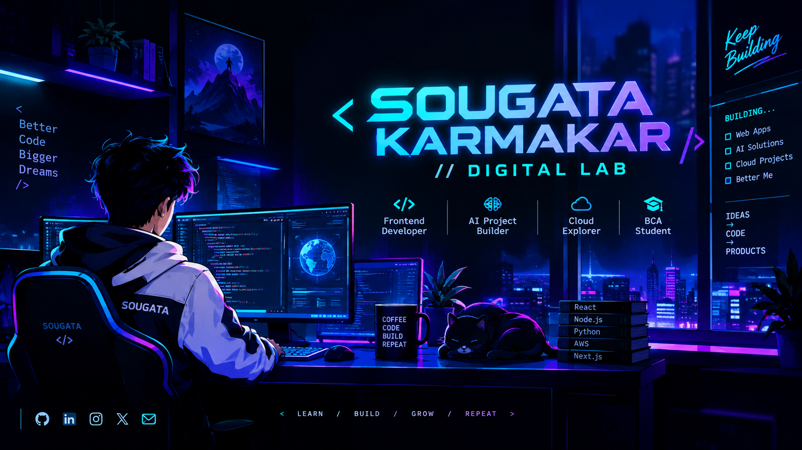

<div align="center">

# ⚡ SOUGATA KARMAKAR

<div align="center">



</div>

### `Frontend Developer` • `AI Project Builder` • `Cloud Explorer` • `BCA Student`


<br>


</div>

---

## 🧑‍💻 `$ whoami`

```yaml
name: Sougata Karmakar
role: BCA Student & Frontend Developer
education: Techno India Institute of Technology
graduation: 2027

focus:
  - Frontend Development
  - Artificial Intelligence
  - Full Stack Development
  - Cloud Computing
  - Developer Tools

currently:
  - Building AI-powered web applications
  - Exploring modern frontend technologies
  - Experimenting with AWS
  - Participating in hackathons
  - Improving my open-source presence

motto: "Build → Break → Learn → Build Better"
```

---

## ⚡ SYSTEM STATUS

```text
┌───────────────────────────────────────────────────────┐
│                  SOUGATA_OS v2026                     │
├───────────────────────────────────────────────────────┤
│                                                       │
│  ● Coding              [████████████████░░] ACTIVE    │
│  ● Learning            [█████████████████░] ACTIVE    │
│  ● Building            [██████████████████] ACTIVE    │
│  ● AI Experiments      [██████████████░░░░] ACTIVE    │
│  ● Open Source         [███████████░░░░░░░] ONLINE    │
│                                                       │
│  STATUS:             🟢 ONLINE                       │
│  CURRENT MODE:       🚀 BUILDING                     │
│  NEXT MISSION:       CREATE SOMETHING USEFUL         │
│                                                       │
└───────────────────────────────────────────────────────┘
```

---

## 🧬 DEVELOPER DNA

<div align="center">

| Domain       | Technologies                               |
| ------------ | ------------------------------------------ |
| 💻 Languages | C • C++ • Java • Python • JavaScript • PHP |
| 🎨 Frontend  | HTML • CSS • JavaScript • React            |
| ⚙️ Backend   | Node.js • PHP                              |
| 🗄️ Database | DBMS • DynamoDB • RDS                      |
| ☁️ Cloud     | AWS • Lambda • S3 • VPC • RDS              |
| 🤖 AI        | Generative AI • AI-powered Web Apps        |
| 🎮 Creative  | Web Games • Interactive UI • Animations    |
| 🧰 Tools     | Git • GitHub • VS Code                     |

</div>

---

## 🧪 CURRENTLY EXPERIMENTING

```text
01  →  AI-powered developer tools
02  →  AI + Web applications
03  →  Modern React interfaces
04  →  AWS cloud-based applications
05  →  Interactive frontend experiences
06  →  Hackathon-ready solutions
07  →  Open-source projects
```

> My goal isn't just to learn technologies — it's to **turn them into things people can actually use.**

---

# 🚀 FEATURED PROJECTS

### 🎮 Neon Tic Tac Toe

> A futuristic browser-based Tic Tac Toe experience.

**Highlights**

* 🤖 AI game modes
* 👥 Local 2-player mode
* 🏆 Win & draw detection
* 📊 Persistent scoreboard
* 🔊 Web Audio API sound effects
* 🎉 Canvas confetti
* ✏️ Editable player names
* 📱 Responsive neon interface

**Stack:** `HTML` `CSS` `JavaScript` `Web Audio API` `Canvas`

---

### 🧬 AI GitHub README Generator

> An AI-powered tool designed to help developers generate professional GitHub README files.

**Focus**

* 🤖 AI-generated documentation
* 📝 Developer-friendly output
* ⚡ Faster project documentation
* 🎨 Customizable README structure

**Stack:** `AI` `JavaScript` `Web Development`

---

### 🗳️ VoteCast

> A modern online voting system concept focused on secure and structured digital voting.

**Focus**

* 🔐 Duplicate-vote handling
* ☁️ AWS/DynamoDB integration
* ⚡ API-based architecture
* 📊 Structured voting data
* 🧪 Testing & validation

**Stack:** `React` `AWS` `DynamoDB` `JavaScript` `Fetch API`

---

## 🏆 ACHIEVEMENTS & EXPERIENCES

```text
🏆 Smart India Hackathon
   └─ Participated in SIH internal hackathon activities

🤖 Google AI / Gemini Challenge
   └─ Google AI Gemini 2.0 Write Off Challenge

🧠 Google Gen AI Academy
   └─ Hack2Skills Google Gen AI Academy 2.0

☁️ AWS Internship
   └─ Explored AWS services and cloud technologies

🚆 Rail Kaushal Vikas Yojana
   └─ Internship — Noapara Metro Rail
      July 2025
```

---

## 📚 EDUCATION

### 🎓 Techno India Institute of Technology

**Bachelor of Computer Applications — BCA**

`2023 — 2027`

Relevant areas:

`Data Structures` • `DBMS` • `Java` • `PHP` • `Cloud Computing` • `Full Stack Development`

---

### 🏫 Dumdum Kishore Bharati High School

**Higher Secondary — 2023**
`61.2%`

**Secondary — 2021**
`80%`

Early interest in:

`IoT` • `Sensors` • `Microcontrollers` • `Embedded Systems` • `Programming`

---

# 📡 MISSION LOG

```text
2021 ──► Secondary Education
           │
2023 ──► Higher Secondary
           │
           ├──► Started BCA
           │
2025 ──► AWS / Technical Learning
           │
           ├──► Rail Kaushal Vikas Yojana
           │
2026 ──► AI + Web Development
           │
           ├──► Hackathons
           ├──► Developer Projects
           ├──► GitHub Experiments
           └──► Open Source Journey
           │
2027 ──► BCA Graduation 🎓
           │
           └──► NEXT MISSION: 🚀
```

---

# 📊 GITHUB COMMAND CENTER

<div align="center">


</div>

<br>

<div align="center">


</div>

---

# 🐍 CONTRIBUTION MATRIX

<div align="center">


</div>

---

# 🌐 THE DEVELOPER STACK

<div align="center">


</div>

---

# 🎯 2026 → 2027 ROADMAP

```text
[x] Learn web development
[x] Build frontend projects
[x] Explore React
[x] Learn cloud fundamentals
[x] Participate in hackathons
[x] Build AI experiments

[ ] Contribute more to open source
[ ] Build production-grade AI applications
[ ] Deepen AWS knowledge
[ ] Build more full-stack applications
[ ] Collaborate with developers
[ ] Ship projects used by real people
```

---

# 🧠 WHAT I'M TRYING TO BUILD

<div align="center">

### Ideas → Code → Products

</div>

I enjoy building projects where **technology solves an actual problem**.

My current interests sit at the intersection of:

```text
          ┌──────────────┐
          │      AI      │
          └──────┬───────┘
                 │
                 ▼
┌───────────┐  BUILD  ┌────────────┐
│    WEB    │ ◄─────► │   CLOUD    │
└───────────┘          └────────────┘
                 │
                 ▼
          ┌──────────────┐
          │    USERS     │
          └──────────────┘
```

---

# 💡 FUN FACTS

```text
⚡ I enjoy turning random ideas into projects.

🎨 I like futuristic and interactive UI.

🤖 AI + Web is one of my favorite combinations.

🏏 Cricket is one of my favorite sports.

🧩 I enjoy solving problems by building things.

☕ Debugging somehow works better with coffee.
```

---

# 🤝 LET'S CONNECT

<div align="center">

<a href="https://sougata-karmakar.netlify.app/">

</a>

<a href="https://github.com/sougatadomain">

</a>

<a href="https://www.linkedin.com/in/sougata-karmakar-a5796831b/">

</a>

<a href="https://www.instagram.com/xenon_e5">

</a>

<a href="https://x.com/SougataKar97344">

</a>

<a href="mailto:sougatakarmakar22@gmail.com">

</a>

</div>

---

<div align="center">

### 💻 BUILD SOMETHING. BREAK SOMETHING. LEARN SOMETHING.

```text
> connection established...
> user: SOUGATA
> status: building 🚀
> system: online 🟢
```


<br><br>


</div>
